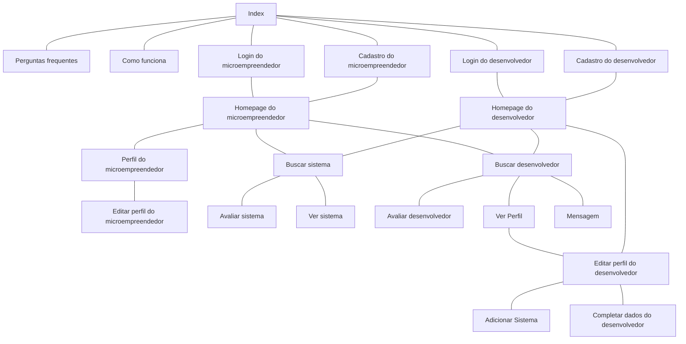

# Protótipos de Interface com o Usuário

## Mapa do Site

> Obs.: propõem-se a utilização de alguma ferramenta que possibilite a representação textual do diagrama. como o seguinte exemplo:

## A. Tela 1: Index

> https://www.figma.com/file/s41bxH7WI2saZvLkUiIVA9/Sisteminha?type=design&node-id=0%3A1&mode=design&t=m5HGIgOakCzQFhiK-1

## B. Tela 2: Cadastro do microempreendedor

> https://www.figma.com/file/s41bxH7WI2saZvLkUiIVA9/Sisteminha?type=design&node-id=0%3A1&mode=design&t=m5HGIgOakCzQFhiK-1

## C. Tela 3: Login do microempreendedor

> https://www.figma.com/file/s41bxH7WI2saZvLkUiIVA9/Sisteminha?type=design&node-id=0%3A1&mode=design&t=m5HGIgOakCzQFhiK-1

## D. Tela 4: Cadastro do desenvolvedor

> https://www.figma.com/file/s41bxH7WI2saZvLkUiIVA9/Sisteminha?type=design&node-id=0%3A1&mode=design&t=m5HGIgOakCzQFhiK-1

## E. Tela 5: Login do desenvolvedor

> https://www.figma.com/file/s41bxH7WI2saZvLkUiIVA9/Sisteminha?type=design&node-id=0%3A1&mode=design&t=m5HGIgOakCzQFhiK-1

## F. Tela 6: Homepage do microempreendedor

> https://www.figma.com/file/s41bxH7WI2saZvLkUiIVA9/Sisteminha?type=design&node-id=0%3A1&mode=design&t=m5HGIgOakCzQFhiK-1

## G. Tela 7: Perfil do microempreendedor

> https://www.figma.com/file/s41bxH7WI2saZvLkUiIVA9/Sisteminha?type=design&node-id=0%3A1&mode=design&t=m5HGIgOakCzQFhiK-1

## H. Tela 8: Editar perfil do microempreendedor

> https://www.figma.com/file/s41bxH7WI2saZvLkUiIVA9/Sisteminha?type=design&node-id=0%3A1&mode=design&t=m5HGIgOakCzQFhiK-1

## I. Tela 9: Buscar sistema como microempreendedor

> https://www.figma.com/file/s41bxH7WI2saZvLkUiIVA9/Sisteminha?type=design&node-id=0%3A1&mode=design&t=m5HGIgOakCzQFhiK-1

## J. Tela 10: Buscar desenvolvedor como microempreendedor

> https://www.figma.com/file/s41bxH7WI2saZvLkUiIVA9/Sisteminha?type=design&node-id=0%3A1&mode=design&t=m5HGIgOakCzQFhiK-1

## K. Tela 11: Avaliar desenvolvedor

> https://www.figma.com/file/s41bxH7WI2saZvLkUiIVA9/Sisteminha?type=design&node-id=0%3A1&mode=design&t=m5HGIgOakCzQFhiK-1

## L. Tela 12: Avaliar sistema

> https://www.figma.com/file/s41bxH7WI2saZvLkUiIVA9/Sisteminha?type=design&node-id=0%3A1&mode=design&t=m5HGIgOakCzQFhiK-1

## M. Tela 13: Visualizar perfil do desenvolvedor como microempreendedor

> https://www.figma.com/file/s41bxH7WI2saZvLkUiIVA9/Sisteminha?type=design&node-id=0%3A1&mode=design&t=m5HGIgOakCzQFhiK-1

## N. Tela 14:  Homepage do desenvolvedor

> https://www.figma.com/file/s41bxH7WI2saZvLkUiIVA9/Sisteminha?type=design&node-id=0%3A1&mode=design&t=m5HGIgOakCzQFhiK-1

## O. Tela 15: Perfil do desenvolvedor

> https://www.figma.com/file/s41bxH7WI2saZvLkUiIVA9/Sisteminha?type=design&node-id=0%3A1&mode=design&t=m5HGIgOakCzQFhiK-1

## P. Tela 16: Editar perfil do desenvolvedor

> https://www.figma.com/file/s41bxH7WI2saZvLkUiIVA9/Sisteminha?type=design&node-id=0%3A1&mode=design&t=m5HGIgOakCzQFhiK-1

## Q. Tela 17: Adicionar Sistema

## R. Tela 18: Completar dados

> https://www.figma.com/file/s41bxH7WI2saZvLkUiIVA9/Sisteminha?type=design&node-id=0%3A1&mode=design&t=m5HGIgOakCzQFhiK-1

## S. Tela 19: Perguntas frequentes

> https://www.figma.com/file/s41bxH7WI2saZvLkUiIVA9/Sisteminha?type=design&node-id=0%3A1&mode=design&t=m5HGIgOakCzQFhiK-1

## T. Tela 20: Como funciona 

> https://www.figma.com/file/s41bxH7WI2saZvLkUiIVA9/Sisteminha?type=design&node-id=0%3A1&mode=design&t=m5HGIgOakCzQFhiK-1

